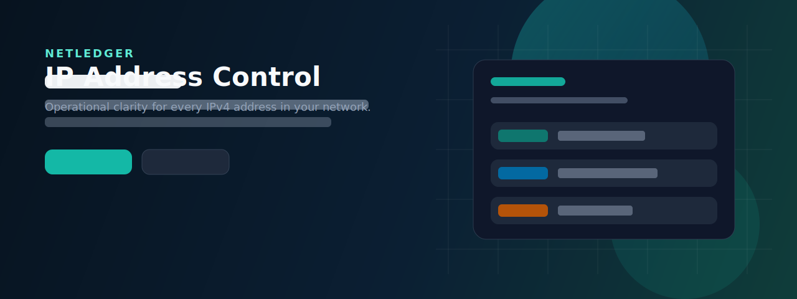

<p align="center">
  
</p>

<h1 align="center">NetLedger · 企业 IP 地址管理系统</h1>

<p align="center">
  <b>轻量级 IPAM：子网规划 · 地址分配 · 回收审计 · 设备台账</b><br/>
  用结构化台账替代 Excel，让内网 IPv4 可管、可查、可追溯
</p>

<p align="center">
  <a href="https://github.com/ibi6/ip-manger/actions/workflows/ci.yml"></a>
  
  
  
  
  
  
</p>

<p align="center">
  
</p>

<p align="center">
  <a href="#-为什么需要">为什么需要</a> ·
  <a href="#-功能矩阵">功能</a> ·
  <a href="#-技术架构">架构</a> ·
  <a href="#-快速开始">快速开始</a> ·
  <a href="#-api-文档">API</a> ·
  <a href="#-安全说明">安全</a> ·
  <a href="#-路线图">路线图</a> ·
  <a href="#-常见问题">FAQ</a>
</p>

---

## 🎯 为什么需要

很多中小网络仍用 **Excel** 管 IP，常见问题：

- 同一地址分给两个人  
- 离职/下线后地址不回收  
- 不清楚某段 `/24` 还剩多少  
- 审计时说不清「谁改过」

**NetLedger** 是一套轻量 **IP 地址管理（IPAM）** 系统：状态清晰、流程可控、操作可审计，笔记本几分钟即可跑起来。

| 对比 | Excel | 重型商业 IPAM | **NetLedger** |
|------|-------|---------------|---------------|
| 上手时间 | 快 | 慢 | **分钟级** |
| 生命周期 + 审计 | 靠人 | 强 | **内置** |
| 成本 | 低 | 高 | **开源免费** |
| 定位 | 表格 | 全家桶 | **台账型 IPAM，边界诚实** |

产品定位详见：[docs/PRODUCT.md](docs/PRODUCT.md)

---

## ✨ 功能矩阵

| 领域 | 能力 |
|------|------|
| **认证权限** | 可撤销 JWT · 四角色 · 强密码 · 失败登录限流 |
| **拓扑规划** | 站点 · 子网（CIDR）· 自动生成地址池 |
| **地址生命周期** | 分配 · 预留 · 回收 · 禁用 · 启用 · 一键下一空闲 |
| **安全机制** | 网关/广播锁定 · 条件更新防双分配 · 子网先归档 |
| **资产** | 设备台账 · MAC 唯一 · 分配时绑定设备 |
| **运维** | 看板统计 · 操作日志 · 冲突记录 · CSV 导入导出 |
| **体验** | 浅色 · 深色 · 跟随系统主题 · 移动端抽屉 · 无障碍交互 |
| **工程** | OpenAPI `/docs` · Docker Compose · pytest · GitHub Actions |

### 角色一览

| 角色 | 说明 |
|------|------|
| `admin` | 全部权限（含用户/部门） |
| `network_admin` | 子网、地址操作、设备、冲突 |
| `dept_user` | 本部门范围可分配空闲地址 |
| `viewer` | 以只读为主 |

---

## 🧱 技术栈

| 层级 | 技术 |
|------|------|
| 后端 | **Python 3.11+** · FastAPI · SQLAlchemy 2 · JWT · bcrypt |
| 前端 | **React 19** · TypeScript · Vite · Tailwind CSS |
| 数据 | 单机 **SQLite**，生产可用 **PostgreSQL**（Alembic 迁移） |
| 部署 | Docker Compose · Nginx 反代前端 |
| 质量 | pytest · GitHub Actions CI |

> 后端核心是 **Python**；前端是 React SPA。写介绍请按此表，勿写 Flask / Bootstrap。

---

## 🏗 技术架构

```text
浏览器 (React SPA)
        │  JWT Bearer
        ▼
   FastAPI 路由层  ──►  领域服务层  ──►  SQLAlchemy
        │                    │
        │                    ├─ CIDR 地址池生成
        │                    ├─ 分配/回收 + 审计日志
        │                    └─ 统计聚合
        ▼
   SQLite（单节点）/ PostgreSQL
```

详细说明：[docs/ARCHITECTURE.md](docs/ARCHITECTURE.md)

---

## 🖼 界面入口

| 页面 | 路径 |
|------|------|
| 登录 | `/login` |
| 工作台 | `/` |
| 子网与地址池 | `/subnets`、`/subnets/:id` |
| 地址台账（分页/批量回收） | `/addresses` |
| 设备台账 | `/devices` |
| 操作日志 | `/logs` |
| 用户管理 | `/users`（管理员） |
| 设置 / 改密 / CSV | `/settings` |

登录页右上角和工作台顶栏均可切换 **跟随系统 → 浅色 → 深色**。偏好保存在当前浏览器中，刷新后继续生效；“跟随系统”会响应操作系统的外观变化。

---

## 🚀 快速开始

### 方式 A：本地开发

**1. 启动后端**

```bash
cd backend
python -m venv .venv

# Windows
.\.venv\Scripts\activate

# macOS / Linux
# source .venv/bin/activate

pip install -r requirements-dev.txt
uvicorn app.main:app --reload --host 127.0.0.1 --port 8000
```

**2. 启动前端**

```bash
cd frontend
npm install
npm run dev
```

| 服务 | 地址 |
|------|------|
| 前端页面 | 终端打印的地址（常见 `http://localhost:5173`） |
| 接口文档 | http://127.0.0.1:8000/docs |
| 健康检查 | http://127.0.0.1:8000/health |

### 方式 B：Docker 一键

```bash
docker compose up --build
```

Compose 默认是本地演示模式。生产部署必须设置 `APP_ENV=production`、强 `SECRET_KEY`、`SEED_DEMO_DATA=false` 与一次性 `BOOTSTRAP_ADMIN_PASSWORD`，详见 [部署、备份与回滚](docs/DEPLOYMENT.md)。

| 服务 | 地址 |
|------|------|
| Web | http://localhost |
| API 文档 | http://localhost:8000/docs |

### 方式 C：Makefile

```bash
make install
make test
make backend    # 终端 1
make frontend   # 终端 2
```

### 演示账号

| 用户名 | 密码 | 角色 |
|--------|------|------|
| `admin` | `ChangeMe123!` | 系统管理员 |
| `netadmin` | `ChangeMe123!` | 网络管理员 |
| `biz` | `ChangeMe123!` | 部门用户 |
| `viewer` | `ChangeMe123!` | 只读 |

> 演示账号只会在开发/显式演示模式创建。生产空库不会生成默认账号，缺少强引导密码时会拒绝启动。

---

## 📡 API 文档

- 交互式文档：**Swagger** → `/docs`  
- 文字说明：[docs/API.md](docs/API.md)

```bash
# 登录示例
curl -s -X POST http://127.0.0.1:8000/api/v1/auth/login \
  -H "Content-Type: application/json" \
  -d "{\"username\":\"admin\",\"password\":\"ChangeMe123!\"}"
```

常用写操作：

```http
POST /api/v1/ip-addresses/{id}/allocate
POST /api/v1/ip-addresses/{id}/release
POST /api/v1/ip-addresses/batch-release
POST /api/v1/subnets/{id}/allocate-next
POST /api/v1/subnets/{id}/archive
```

---

## 🚢 部署说明

| 场景 | 建议 |
|------|------|
| 演示 / 实验 | SQLite + Compose 即可 |
| 小团队内网 | 前置 HTTPS，配置 `SECRET_KEY`，收紧 CORS，定期备份 |
| 生产方向 | PostgreSQL，密钥托管，`SEED_DEMO_DATA=false`，恢复演练 |

Compose 配置模板：[`.env.example`](.env.example)；后端本地模板：[`backend/.env.example`](backend/.env.example)
表结构：[`docs/schema.sql`](docs/schema.sql)

```env
APP_ENV=production
SECRET_KEY=<请换成足够长的随机串>
SEED_DEMO_DATA=false
BOOTSTRAP_ADMIN_PASSWORD=<首次启动使用的强密码，成功后移除>
DATABASE_URL=postgresql+psycopg://user:pass@db:5432/netledger
CORS_ORIGINS=https://你的域名
```

- 完整部署、备份、恢复和回滚：[docs/DEPLOYMENT.md](docs/DEPLOYMENT.md)
- 自动化、安全、UI 与用户验收：[docs/TESTING.md](docs/TESTING.md)

---

## 📊 性能说明（设计目标）

| 指标 | 说明 |
|------|------|
| 地址列表 | 支持分页查询，避免一次拉全表到前端 |
| 并发分配 | `UPDATE ... WHERE status='free'`，降低双人抢同一 IP |
| 子网展开 | 对超大前缀做规模限制，防止一次插入过多 |
| 看板/站点统计 | 批量或分组聚合，避免 N+1 |

具体数值随机器与数据库变化；SQLite 适合单节点低并发，不适合高并发多写。多实例登录限流需接入 Redis 等共享存储。

---

## 🗺 路线图

- [x] 地址生命周期 + RBAC + 设备 + 审计  
- [x] 条件分配、批量回收、子网归档  
- [x] CI、Docker、安全策略、产品化文档  
- [ ] 在线演示环境 + 演示动图  
- [ ] 发布容器镜像到 GHCR  
- [ ] 探测结果导入适配器（ARP/Nmap 结果入库）  
- [ ] 可选 OIDC 登录  
- [ ] PostgreSQL 默认 Compose 配置  

---

## ❓ 常见问题

**后端是不是 Python？**  
是。**业务与 API 基于 Python + FastAPI**；页面是 React。

**冲突扫描是真扫网吗？**  
不是。`simulate-scan` 只生成演示用冲突记录，方便走处理流程。

**生产数据库怎么选？**
单节点可继续用 SQLite；多人并发写入建议 PostgreSQL。运行时已包含 psycopg 驱动，迁移由 Alembic 管理。

**能替代 Infoblox 吗？**  
不能对标完整商业 DDI。NetLedger 定位是 **轻量台账型 IPAM**，先解决「看得见、管得住、留得下痕」。

---

## 📁 目录结构

```text
.
├── backend/              # FastAPI + pytest
├── frontend/             # React SPA
├── docs/                 # 产品/架构/API/库表
│   └── assets/           # Logo、Banner
├── .github/workflows/    # CI
├── docker-compose.yml
├── Makefile
└── README.md
```

---

## 🤝 参与贡献

请阅读 [CONTRIBUTING.md](CONTRIBUTING.md) 与 [CODE_OF_CONDUCT.md](CODE_OF_CONDUCT.md)。  
安全问题请看 [SECURITY.md](SECURITY.md)。  
版本记录见 [CHANGELOG.md](CHANGELOG.md)。

---

## 📄 License

[MIT](LICENSE) © NetLedger 贡献者

---

<p align="center">
  <b>NetLedger</b> — 别再用表格硬管生产网 IP。<br/>
  如果对你有帮助，欢迎 Star ⭐
</p>
